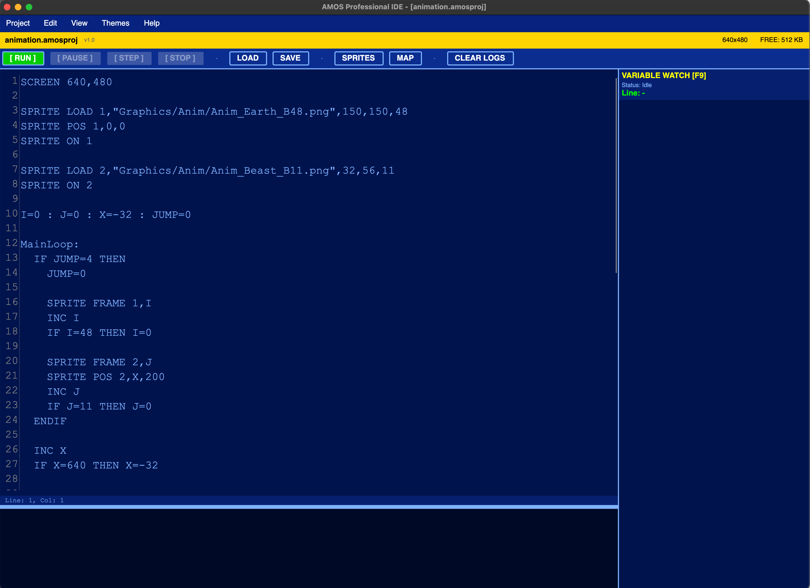
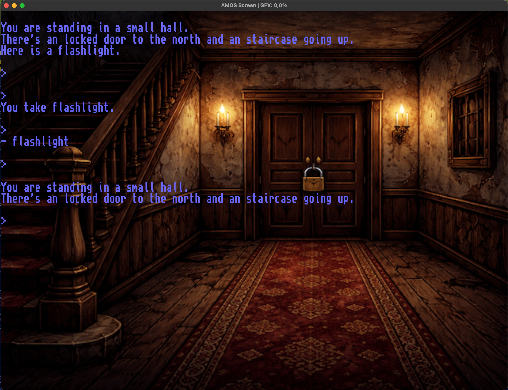

# AMOS Professional Engine
**An AMOS-like BASIC environment for modern platforms (macOS / Windows)**

This project is a modern reimplementation and evolution of the classic **AMOS Professional** environment, designed for contemporary systems while preserving the original development philosophy, syntax style, and creative workflow.

The engine provides a structured BASIC-like language, graphics/audio primitives, windowing, input handling, and tooling intended for:
- retro-style game development
- educational use
- creative coding
- rapid prototyping
- nostalgia-driven projects

---

## Features

- AMOS-style BASIC syntax
- Multi-platform support (macOS / Windows)
- Modern rendering and system APIs
- Structured command system
- Modular engine architecture
- Scriptable runtime
- Developer-focused tooling
- Extensible command system
- AMOS-compatible concepts and workflows

---

## Philosophy

This project is **not an emulator**.  
It is a **modern engine inspired by AMOS**, built to:
- preserve the spirit of classic BASIC environments
- remove legacy hardware limitations
- provide a productive creative coding workflow
- enable modern deployment pipelines

---

## Status

This project is under active development.  
APIs, commands, and internal architecture may change.

---

## License

MIT License

Copyright (c) [YEAR] [YOUR NAME]

Permission is hereby granted, free of charge, to any person obtaining a copy  
of this software and associated documentation files (the "Software"), to deal  
in the Software without restriction, including without limitation the rights  
to use, copy, modify, merge, publish, distribute, sublicense, and/or sell  
copies of the Software, and to permit persons to whom the Software is  
furnished to do so, subject to the following conditions:

The above copyright notice and this permission notice shall be included in all  
copies or substantial portions of the Software.

THE SOFTWARE IS PROVIDED "AS IS", WITHOUT WARRANTY OF ANY KIND, EXPRESS OR  
IMPLIED, INCLUDING BUT NOT LIMITED TO THE WARRANTIES OF MERCHANTABILITY,  
FITNESS FOR A PARTICULAR PURPOSE AND NONINFRINGEMENT. IN NO EVENT SHALL THE  
AUTHORS OR COPYRIGHT HOLDERS BE LIABLE FOR ANY CLAIM, DAMAGES OR OTHER  
LIABILITY, WHETHER IN AN ACTION OF CONTRACT, TORT OR OTHERWISE, ARISING FROM,  
OUT OF OR IN CONNECTION WITH THE SOFTWARE OR THE USE OR OTHER DEALINGS IN THE  
SOFTWARE.

IDE

Exampel on Adventure game

